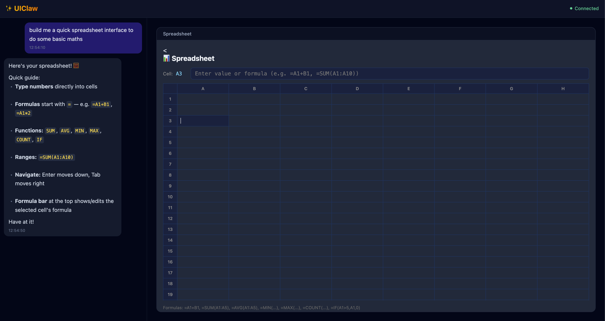
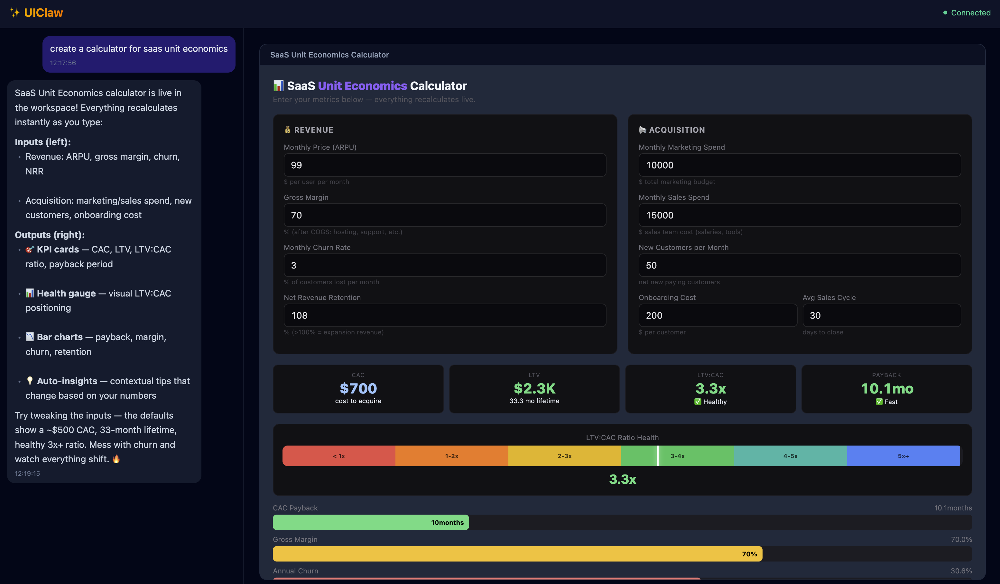
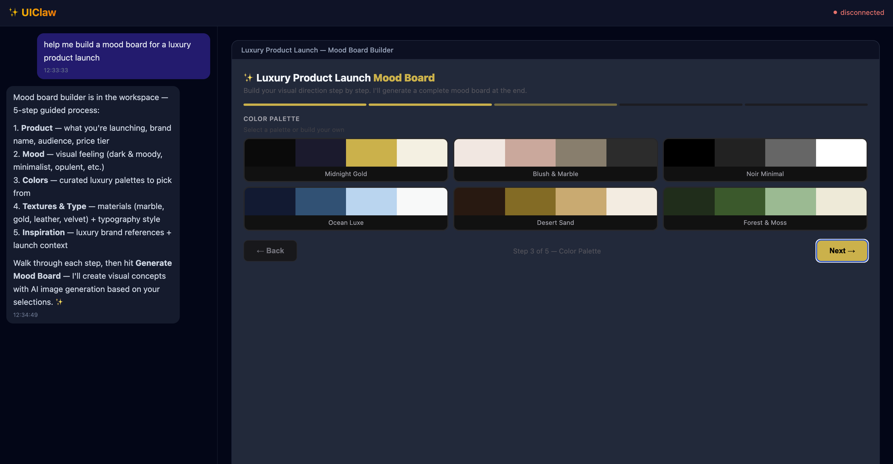
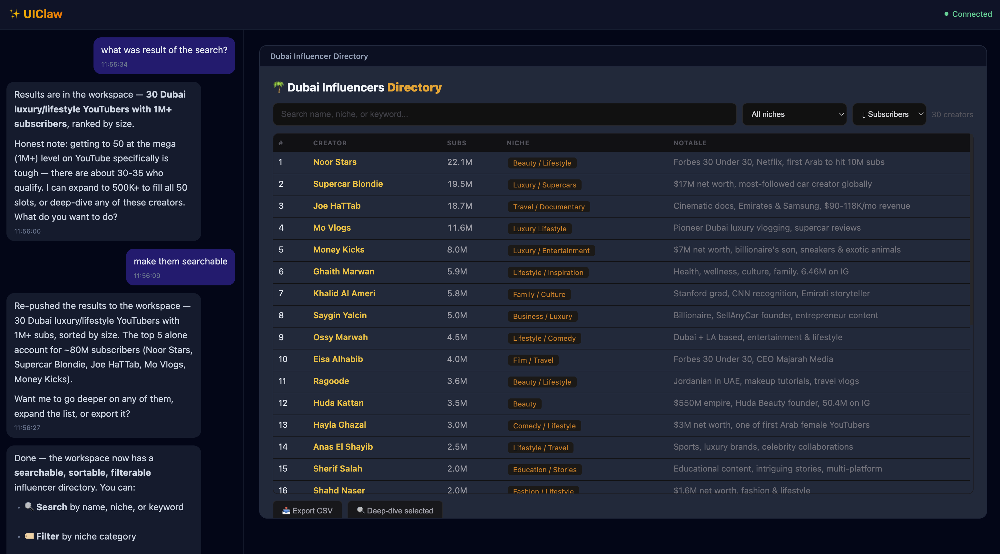

# ✨ UIClaw

**Rich dynamic web UI for OpenClaw agents.**

UIClaw gives your OpenClaw agent a modern split-panel web interface — chat on the left, dynamic workspace on the right. Ask for anything and the agent builds it live: spreadsheets, dashboards, multi-step wizards, data tables, calculators. All interactive, all in the browser.

## Examples

> Every interface below was generated from a single natural-language prompt.

| Spreadsheet | SaaS Unit Economics |
|:-:|:-:|
|  |  |
| *"Build me a quick spreadsheet to do some basic maths"* | *"Build a SaaS unit economics calculator"* |

| Mood Board Builder | Influencer Directory |
|:-:|:-:|
|  |  |
| *"Create a luxury product launch mood board builder"* | *"Find 30 Dubai luxury YouTubers with 1M+ subs"* |

## How It Works

You describe what you want in plain English. The agent builds a fully interactive HTML/JS interface and pushes it to the workspace panel. Interfaces are saved to a local registry so they load instantly next time.

No templates. No drag-and-drop. Just describe it.

## Features

- 💬 **Chat + Workspace** — Split-panel: conversation on the left, rich UI on the right
- 🎨 **Dynamic UI Generation** — Agent builds full interactive interfaces from natural language
- 📦 **Interface Registry** — Built interfaces are saved to disk and reloaded instantly on repeat requests
- 📸 **Auto Screenshots** — Playwright captures a screenshot of every interface for the registry browser
- 📝 **Smart Forms** — Collect structured input via `uiclaw_form` or custom Canvas HTML
- 🔄 **Canvas Bridge** — Custom HTML can send structured data back to the agent via `sendToApp()`
- 🔌 **OpenClaw Plugin** — Registers `uiclaw_render`, `uiclaw_canvas`, `uiclaw_form`, `uiclaw_read`, `uiclaw_load` as agent tools
- 🌐 **Works Anywhere** — Localhost or behind Cloudflare Tunnel

## Architecture

```
┌─────────────────────────────────────────────────────┐
│  Browser (React)                                     │
│  ┌──────────┐  ┌──────────────────────────────────┐ │
│  │   Chat    │  │         Workspace Panel          │ │
│  │  panel    │  │  Cards / Tables / Canvas / Forms │ │
│  └────┬─────┘  └──────────────┬───────────────────┘ │
│       │ WebSocket              │ postMessage          │
└───────┼────────────────────────┼─────────────────────┘
        ↕                        ↕
┌───────────────────────────────────────────────────────┐
│  UIClaw Server (Node.js, port 3800)                   │
│  • Shared gateway — single OpenClaw connection        │
│    shared across all browser clients                  │
│  • POST /api/ui — receives UI specs from plugin       │
│  • Playwright screenshots saved to registry           │
│  • GET /files/* — serves local images/files           │
└───────────────────┬───────────────────────────────────┘
                    ↕ Gateway WebSocket (JSON-RPC)
┌───────────────────────────────────────────────────────┐
│  OpenClaw Gateway                                     │
│  • Runs the agent session (agent:main:uiclaw)         │
│  • Plugin tools push specs via HTTP to UIClaw server   │
└───────────────────────────────────────────────────────┘
```

## Quick Start

### 1. Install dependencies

```bash
git clone https://github.com/askgvt-bot/uiclaw.git
cd uiclaw
pnpm install
```

### 2. Build the frontend

```bash
cd packages/web && pnpm build && cd ../..
```

### 3. Configure OpenClaw

Add the plugin to your OpenClaw config (`~/.openclaw/openclaw.json`):

```json
{
  "plugins": {
    "allow": ["uiclaw"],
    "paths": ["/path/to/uiclaw/extensions/uiclaw/index.ts"]
  }
}
```

### 4. Start the server

```bash
cd packages/server
OPENCLAW_GATEWAY_URL=ws://127.0.0.1:18789 \
OPENCLAW_GATEWAY_TOKEN=your-gateway-token \
npx tsx src/index.ts
```

### 5. Open the UI

Navigate to `http://localhost:3800`

## Agent Tools

| Tool | Description |
|------|-------------|
| `uiclaw_render` | Push component trees (Stack, Card, DataTable, Markdown, ImageGrid, ColorPalette) |
| `uiclaw_canvas` | Push custom HTML/CSS/JS rendered in a sandboxed iframe |
| `uiclaw_form` | Show a form and wait for user input |
| `uiclaw_read` | List saved interfaces or read HTML code for editing |
| `uiclaw_load` | Load a previously saved interface from the registry (instant, zero tokens) |

### Canvas Bridge

Custom Canvas HTML can communicate back to the agent without polluting the chat:

```html
<button onclick="sendToApp('research', { names: ['Nick Halstead'] })">
  Research
</button>
```

## Interface Registry

Every interface built by the agent is automatically:

1. **Saved to disk** — HTML stored in `~/.openclaw/workspace/uiclaw-registry/interfaces/`
2. **Screenshotted** — Playwright captures a PNG for the registry browser
3. **Indexed** — Name, ID, and metadata tracked in `index.json`

On repeat requests, the agent loads the existing interface from disk instead of rebuilding — instant load, zero LLM tokens.

## Environment Variables

| Variable | Default | Description |
|----------|---------|-------------|
| `OPENCLAW_GATEWAY_URL` | `ws://127.0.0.1:18789` | Gateway WebSocket URL |
| `OPENCLAW_GATEWAY_TOKEN` | — | Gateway auth token |
| `UICLAW_PORT` | `3800` | Server port |
| `UICLAW_HOST` | `127.0.0.1` | Server bind address |

## Project Structure

```
uiclaw/
├── extensions/uiclaw/     # OpenClaw plugin (agent tools)
│   └── index.ts
├── packages/
│   ├── server/            # Node.js bridge server
│   │   └── src/
│   │       ├── index.ts          # HTTP + WS + shared gateway
│   │       └── gateway-client.ts # OpenClaw Gateway client
│   ├── web/               # React frontend
│   │   └── src/
│   │       ├── App.tsx           # Main app
│   │       └── components.tsx    # UI component renderers
│   └── ui-engine/         # Layout + component utilities
└── README.md
```

## Requirements

- [OpenClaw](https://github.com/openclaw/openclaw) running locally
- Node.js 22+
- pnpm

## License

MIT
